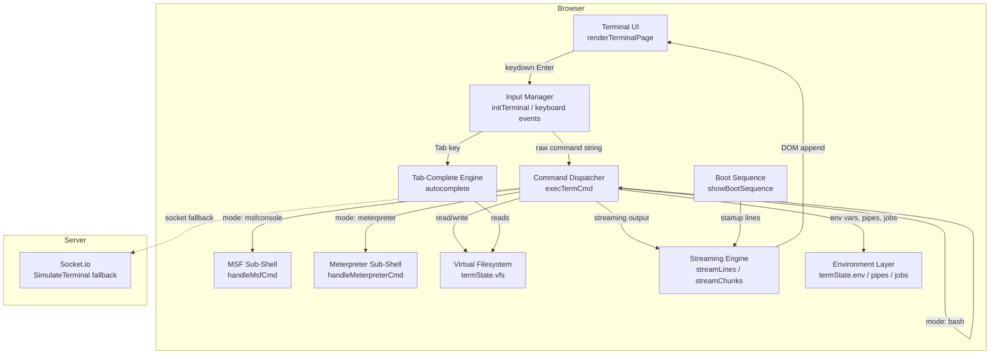
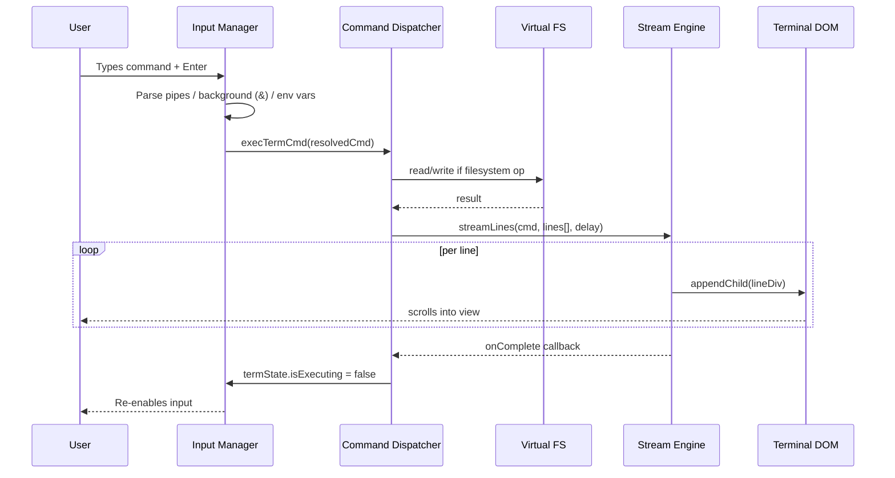
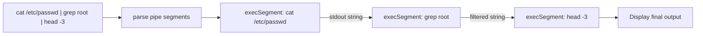

# Design Document: Kali Web Terminal

## Overview

A massively expanded in-browser Kali Linux terminal for the CyberForge Academy platform that simulates the real Kali OS experience — complete with a full virtual filesystem, 100+ bash commands, a comprehensive hacking tool suite with streaming output, Metasploit's full module tree, pipe and background-job support, and a Kali-accurate boot sequence. All execution runs entirely client-side in vanilla JS inside `client/public/app.js`; the server-side `simulateTerminal()` in `server/index.js` is updated to mirror the expanded command set as a fallback.

The design covers two artifacts: (1) a High-Level architecture showing components, VFS structure, data-flow, and component interactions, and (2) a Low-Level view of key data structures, function signatures, the command-dispatch pattern, and the streaming architecture.

---

## Architecture

### System Overview




### Component Interactions



### Data Flow: Pipe Support



---

## VFS Structure

The expanded virtual filesystem replicates the Kali Linux root layout. Pre-populated at `termState` initialisation.

```mermaid
graph TD
    ROOT["/"]
    ROOT --> BIN["/bin"]
    ROOT --> SBIN["/sbin"]
    ROOT --> ETC["/etc"]
    ROOT --> HOME["/home/kali  ← cwd default"]
    ROOT --> OPT["/opt"]
    ROOT --> ROOT2["/root"]
    ROOT --> TMP["/tmp"]
    ROOT --> USR["/usr"]
    ROOT --> VAR["/var"]
    ROOT --> PROC["/proc"]
    ROOT --> DEV["/dev"]

    ETC --> PASSWD["/etc/passwd"]
    ETC --> SHADOW["/etc/shadow"]
    ETC --> HOSTS["/etc/hosts"]
    ETC --> OSREL["/etc/os-release"]
    ETC --> CRONTAB["/etc/crontab"]

    HOME --> DESKTOP["/home/kali/Desktop"]
    HOME --> DOCS["/home/kali/Documents"]
    HOME --> DLOADS["/home/kali/Downloads"]
    HOME --> BASHRC["/home/kali/.bashrc"]
    HOME --> BASH_HIST["/home/kali/.bash_history"]
    HOME --> CTF["/home/kali/ctf_workspace/"]

    USR --> USRBIN["/usr/bin"]
    USR --> USRSHARE["/usr/share"]
    USRSHARE --> WL["/usr/share/wordlists"]
    WL --> ROCKYOU["/usr/share/wordlists/rockyou.txt"]
    WL --> DIRBUSTER["/usr/share/wordlists/dirbuster/"]
    USRSHARE --> NMAP["/usr/share/nmap/scripts/"]
    USRSHARE --> METASPLOIT["/usr/share/metasploit-framework/"]
    USRSHARE --> EXPLOITDB["/usr/share/exploitdb/"]

    OPT --> SQLMAP["/opt/sqlmap"]
    OPT --> NMAP_SCRIPTS["/opt/nmap-scripts"]
    OPT --> WORDLISTS["/opt/wordlists"]
    OPT --> MSF["/opt/metasploit-framework"]

    ROOT2 --> ROOTBASH["/root/.bashrc"]
    ROOT2 --> ROOTTXT["/root/root.txt"]

    VAR --> LOG["/var/log"]
    LOG --> SYSLOG["/var/log/syslog"]
    LOG --> AUTH["/var/log/auth.log"]
```




---

## Components and Interfaces

### 1. `termState` — Central State Object

The single source of truth for all terminal state. Extended from the current minimal object.

**Interface (expanded)**:
```javascript
const termState = {
  // Shell state
  cwd: '/home/kali',
  mode: 'bash',           // 'bash' | 'msfconsole' | 'meterpreter' | 'python3'
  msfModule: '',
  msfOptions: {},         // { RHOSTS, RPORT, LHOST, LPORT, PAYLOAD, ... }
  meterpreterSession: 1,

  // Virtual Filesystem
  vfs: { [path: string]: VFSNode },

  // Environment
  env: {                  // $VAR expansion
    USER: 'kali', HOME: '/home/kali',
    PATH: '/usr/local/sbin:/usr/local/bin:/usr/sbin:/usr/bin:/sbin:/bin',
    SHELL: '/bin/bash', TERM: 'xterm-256color',
    PWD: '/home/kali', HOSTNAME: 'kali',
  },
  aliases: { [name: string]: string },   // alias ll='ls -la'
  exports: Set<string>,                  // exported env vars

  // Jobs / background processes
  jobs: [{ id: number, cmd: string, status: 'running'|'stopped'|'done' }],
  nextJobId: 1,

  // Installed tools registry
  installedTools: Set<string>,

  // History
  history: string[],
  historyIdx: number,

  // Execution lock
  isExecuting: boolean,

  // Python REPL state
  pythonLines: string[],
  pythonMode: boolean,
};
```

**VFSNode type**:
```javascript
// VFSNode
{ type: 'dir' }
{ type: 'file', content: string, permissions: string, owner: string, size: number }
{ type: 'link', target: string }
```

### 2. Command Dispatcher — `execTermCmd(cmdStr)`

Entry point for all user input. Handles pre-processing before routing to tool handlers.

**Responsibilities**:
- Strip leading/trailing whitespace
- Detect and handle pipe chains (`|`) — split, run each segment feeding stdout to next
- Detect background operator (`&`) — mark as background job, don't block input
- Expand environment variables (`$HOME`, `$PATH`, `$USER`, custom)
- Expand aliases
- Route to correct mode handler: bash / msfconsole / meterpreter / python3
- Guard with `isExecuting` lock for streaming commands

**Signature**:
```javascript
function execTermCmd(cmdStr: string): void
```


### 3. Streaming Engine — `streamLines()` / `streamChunks()`

Drives the real-time feel. Two variants:

**`streamLines(cmd, lines, delayPerLine, onComplete)`** — existing, streams one HTML line at a time with fixed delay.

**`streamChunks(cmd, chunks, onComplete)`** — new variant for variable-delay streaming (e.g. apt progress bar that updates same line):
```javascript
// chunks: Array<{ html: string, delay: number, replacePrev?: boolean }>
function streamChunks(cmd: string, chunks: StreamChunk[], onComplete?: () => void): void
```

**`streamProgressBar(cmd, label, steps, onComplete)`** — renders an inline animated progress bar for apt download simulation:
```javascript
function streamProgressBar(cmd: string, label: string, steps: number, onComplete?: () => void): void
```

### 4. VFS Helpers

```javascript
function resolvePath(pathStr: string): string         // existing, expand ~, .., relative
function vfsLs(dirPath: string): VFSEntry[]           // list children of a directory
function vfsMkdirP(dirPath: string): void             // mkdir -p recursive
function vfsCat(filePath: string): string | null      // return file content or null
function vfsWrite(filePath: string, content: string, append?: boolean): void
function vfsCp(src: string, dest: string): void       // copy file or dir
function vfsMv(src: string, dest: string): void       // move/rename
function vfsFind(root: string, pattern: string): string[]  // find files matching glob
function vfsTree(dirPath: string, depth?: number): string  // tree-formatted string
function vfsDu(dirPath: string): number               // disk usage in bytes
function vfsLn(src: string, dest: string, symbolic?: boolean): void
```

### 5. Boot Sequence — `showBootSequence(onDone)`

Plays on first terminal load. Streams ASCII banner + systemd-style service init lines, then calls `onDone`.

```javascript
function showBootSequence(onDone: () => void): void
```

### 6. Expanded Autocomplete — `autocomplete(partial)`

Extended to cover all 100+ commands, flag suggestions, and full VFS path traversal.

```javascript
function autocomplete(partial: string): void
// also handles: nmap -<Tab> → shows flag options, cd /ho<Tab> → /home/
```

### 7. Pipe Engine — `executePipeline(segments, onComplete)`

```javascript
// segments: string[] — each is a command string
// Executes left-to-right, passing stdout of each as stdin to next
// stdin is passed as the optional last argument to exec handlers
function executePipeline(segments: string[], onComplete?: () => void): void
```

### 8. Environment Variable Expansion — `expandEnv(cmdStr)`

```javascript
function expandEnv(cmdStr: string): string
// Replaces $VAR and ${VAR} with values from termState.env
// Handles $? (last exit code), $$ (PID stub), $! (background job PID stub)
```


---

## Data Models

### Command Registry

All bash commands are registered in a lookup map, enabling O(1) dispatch and easy extensibility:

```javascript
// commandRegistry: Map<string, CommandHandler>
// CommandHandler: (rawCmd: string, args: string[], stdin?: string) => void | string

const commandRegistry = new Map([
  ['ls',    handleLs],
  ['cat',   handleCat],
  ['grep',  handleGrep],
  // ... 100+ entries
]);
```

### Tool Output Templates

Each hacking tool has a template factory that returns a `StreamChunk[]` array based on parsed arguments:

```javascript
// toolTemplates: Map<string, ToolTemplateFactory>
// ToolTemplateFactory: (args: string[], flags: FlagMap) => StreamChunk[]

const toolTemplates = new Map([
  ['nmap',       buildNmapOutput],
  ['gobuster',   buildGobusterOutput],
  ['sqlmap',     buildSqlmapOutput],
  ['hydra',      buildHydraOutput],
  ['hashcat',    buildHashcatOutput],
  ['john',       buildJohnOutput],
  ['nikto',      buildNiktoOutput],
  ['masscan',    buildMasscanOutput],
  ['ffuf',       buildFfufOutput],
  ['airmon-ng',  buildAirmonOutput],
  ['airodump-ng',buildAirodumpOutput],
  ['msfconsole', buildMsfBannerOutput],
  // ... all tools
]);
```

### MSF Module Database (client-side)

```javascript
const msfModules = [
  { path: 'exploit/multi/http/vsftpd_234_backdoor',   rank: 'excellent', date: '2011-07-03', desc: 'VSFTPD v2.3.4 Backdoor' },
  { path: 'exploit/windows/smb/ms17_010_eternalblue', rank: 'average',   date: '2017-03-14', desc: 'EternalBlue SMB RCE' },
  { path: 'exploit/multi/http/apache_log4j_rce',      rank: 'excellent', date: '2021-12-10', desc: 'Log4j RCE' },
  { path: 'exploit/linux/http/drupal_drupalgeddon2',  rank: 'excellent', date: '2018-03-28', desc: 'Drupalgeddon2 RCE' },
  { path: 'auxiliary/scanner/portscan/tcp',           rank: 'normal',    date: '',           desc: 'TCP Port Scanner' },
  { path: 'post/multi/gather/enum_system',            rank: 'normal',    date: '',           desc: 'System Enumeration' },
  // ... 30+ modules
];
```

### Flag Argument Parser

```javascript
// parseArgs(parts: string[]): { positional: string[], flags: FlagMap }
// FlagMap: { [flag: string]: string | true }
// e.g. nmap -sV -p 1-1000 10.10.10.5 → flags: {sV:true, p:'1-1000'}, positional:['10.10.10.5']
function parseArgs(parts: string[]): ParsedArgs
```

---

## Key Algorithms / Streaming Architecture

### Boot Sequence Algorithm

```pascal
PROCEDURE showBootSequence(onDone)
  INPUT: callback onDone
  
  SEQUENCE
    bootLines ← [
      ASCII Kali dragon banner (multiline),
      "Kali GNU/Linux Rolling [6.6.0-kali1-amd64]",
      "[ OK ] Started D-Bus System Message Bus",
      "[ OK ] Started Network Manager",
      "[ OK ] Started SSH daemon",
      "[ OK ] Started Apache2 web server",
      "[ OK ] Reached target Multi-User System",
      "",
      "kali login: kali",
      "Password: ****",
      "Linux kali 6.6.0-kali1-amd64 ...",
      motd lines,
      ""
    ]
    streamLines(null, bootLines, 80, onDone)
  END SEQUENCE
END PROCEDURE
```

### Pipe Execution Algorithm

```pascal
PROCEDURE executePipeline(segments)
  INPUT: segments — array of command strings
  
  SEQUENCE
    stdin ← ""       // initial stdin is empty
    
    FOR i FROM 0 TO segments.length - 2 DO
      stdout ← execSegmentSync(segments[i], stdin)
      stdin ← stdout
    END FOR
    
    // Last segment renders to terminal
    execSegmentStream(segments[last], stdin)
  END SEQUENCE
END PROCEDURE

PROCEDURE execSegmentSync(cmd, stdin)
  INPUT: cmd string, optional stdin string
  OUTPUT: stdout string (no DOM rendering)
  
  SEQUENCE
    parsed ← parseCommand(cmd)
    MATCH parsed.name WITH
      "grep"  → RETURN grepFilter(stdin, parsed.args)
      "head"  → RETURN headFilter(stdin, parsed.args)
      "tail"  → RETURN tailFilter(stdin, parsed.args)
      "sort"  → RETURN sortFilter(stdin)
      "uniq"  → RETURN uniqFilter(stdin)
      "wc"    → RETURN wcFilter(stdin, parsed.args)
      "cut"   → RETURN cutFilter(stdin, parsed.args)
      "awk"   → RETURN awkFilter(stdin, parsed.args)
      "sed"   → RETURN sedFilter(stdin, parsed.args)
      DEFAULT → RETURN execToString(parsed.name, parsed.args, stdin)
    END MATCH
  END SEQUENCE
END PROCEDURE
```


### APT Install Streaming with Progress Bar

```pascal
PROCEDURE buildAptOutput(pkgName)
  INPUT: pkgName string
  OUTPUT: StreamChunk[]
  
  SEQUENCE
    chunks ← []
    chunks.add({ html: "Reading package lists... Done",          delay: 300 })
    chunks.add({ html: "Building dependency tree... Done",       delay: 250 })
    chunks.add({ html: "Reading state information... Done",      delay: 200 })
    chunks.add({ html: "The following NEW packages: " + pkgName, delay: 150 })
    chunks.add({ html: "Need to get 3,840 kB of archives.",      delay: 100 })
    
    // Animated download progress bar
    FOR pct FROM 0 TO 100 STEP 10 DO
      bar ← renderProgressBar(pct, pkgName)
      chunks.add({ html: bar, delay: 120, replacePrev: pct > 0 })
    END FOR
    
    chunks.add({ html: "Unpacking " + pkgName + " ...",          delay: 300 })
    chunks.add({ html: "Setting up " + pkgName + " ...",         delay: 250 })
    chunks.add({ html: "✓ Package '" + pkgName + "' installed.", delay: 200 })
    
    RETURN chunks
  END SEQUENCE
END PROCEDURE
```

### Nmap Streaming with Port Discovery

```pascal
PROCEDURE buildNmapOutput(args, flags)
  INPUT: args (positional), flags (parsed flag map)
  OUTPUT: StreamChunk[]
  
  SEQUENCE
    targetIp ← args[0] OR "10.10.10.5"
    isAggressive  ← flags.A  = true
    isVersionScan ← flags.sV = true OR isAggressive
    isScriptScan  ← flags.sC = true OR isAggressive
    isOSScan      ← flags.O  = true OR isAggressive
    isAllPorts    ← flags.p  = "-"  OR flags["p-"] = true
    isUDP         ← flags.sU = true
    
    chunks ← [ header lines with timestamp ]
    chunks.add(ARP ping scan lines)
    chunks.add(SYN stealth scan initiation)
    
    openPorts ← selectPorts(flags)  // 21,22,80,443,3306 by default
    
    FOR port IN openPorts DO
      chunks.add({ html: "Discovered open port " + port, delay: 150, color: 'term-success' })
    END FOR
    
    IF isVersionScan THEN
      chunks.add(service scan lines with delays)
    END IF
    IF isScriptScan THEN
      chunks.add(NSE script execution lines)
    END IF
    IF isOSScan THEN
      chunks.add(OS detection lines)
    END IF
    
    chunks.add(formatted port table)
    chunks.add("Nmap done" summary line)
    
    RETURN chunks
  END SEQUENCE
END PROCEDURE
```

### Git Clone Streaming

```pascal
PROCEDURE buildGitCloneOutput(repoUrl)
  INPUT: repoUrl string
  OUTPUT: StreamChunk[], repoName string, repoPath string
  
  SEQUENCE
    repoName ← extractRepoName(repoUrl)
    repoPath ← resolvePath(repoName)
    
    objects   ← randomInt(5000, 50000)
    deltasRez ← randomInt(1000, objects * 0.7)
    sizeMiB   ← (randomInt(2, 200) / 10).toFixed(2)
    speedMiB  ← (randomInt(50, 200) / 10).toFixed(2)
    
    chunks ← [
      "Cloning into '" + repoName + "'...",
      "remote: Enumerating objects: " + objects + ", done.",
      "remote: Counting objects: 100% (" + objects + "/" + objects + "), done.",
      "remote: Compressing objects: 100% ..., done.",
      "remote: Total " + objects + " ...",
    ]
    
    // Receiving objects with animated progress
    FOR pct FROM 0 TO 100 STEP 5 DO
      chunks.add({ html: "Receiving objects: " + pct + "% ...", delay: 80, replacePrev: pct > 0 })
    END FOR
    
    chunks.add("Resolving deltas: 100% (" + deltasRez + "/" + deltasRez + "), done.")
    chunks.add("✓ Repository '" + repoName + "' cloned into " + repoPath)
    
    RETURN chunks
  END SEQUENCE
END PROCEDURE
```


---

## Complete Command Set Reference

### File Operations

| Command | Flags Supported | Notes |
|---------|----------------|-------|
| `ls` | `-l -a -la -R -h -1` | color dirs cyan, files green, executables yellow |
| `cp` | `-r -v` | copies in VFS; recursive for dirs |
| `mv` | | rename/move in VFS |
| `rm` | `-r -f -rf` | recursive delete for dirs |
| `mkdir` | `-p` | `mkdir -p` creates nested dirs |
| `touch` | | creates empty file or updates mtime |
| `ln` | `-s` | symbolic or hard link in VFS |
| `find` | `-name -type -size` | search VFS tree |
| `file` | | detect type from content/extension |
| `stat` | | show inode-style metadata |
| `tree` | `-L <depth>` | recursive ASCII tree |
| `du` | `-sh` | disk usage summary |
| `df` | `-h` | disk free (static simulated output) |
| `chmod` | `+x rwx` | updates permissions field in VFS |
| `chown` | | updates owner field in VFS |

### Text Processing

| Command | Flags Supported |
|---------|----------------|
| `cat` | `-n` (line numbers) |
| `head` | `-n <N>` |
| `tail` | `-n <N> -f` (tail -f simulates live log) |
| `grep` | `-i -r -v -n -l -c` |
| `cut` | `-d -f` |
| `awk` | basic `{print $N}` patterns |
| `sed` | `s/old/new/g` substitution |
| `sort` | `-r -n -u` |
| `uniq` | `-c` |
| `wc` | `-l -w -c` |
| `strings` | output printable strings from file content |
| `xxd` | hex dump of file content |

### Network Commands

| Command | Output |
|---------|--------|
| `ping` | streams 4 ICMP replies with RTT |
| `curl` | simulated HTTP response headers + body |
| `wget` | download progress bar + saved file in VFS |
| `netstat` | static table of listening ports |
| `ss` | same as netstat, `-tlnp` style |
| `traceroute` | streams hop-by-hop with latencies |
| `host` | DNS lookup simulation |
| `dig` | ANSWER SECTION with TTL |
| `whois` | domain registration block |

### Process / System

| Command | Output |
|---------|--------|
| `ps aux` | static process table with kali processes |
| `top` | static snapshot ASCII table |
| `kill` | removes from jobs list |
| `jobs` | lists background jobs |
| `bg` / `fg` | moves jobs |
| `date` | current date/time |
| `uptime` | simulated uptime |
| `free` | memory table |
| `lscpu` | CPU info block |
| `env` | dumps `termState.env` |
| `export` | adds var to env + exports set |
| `alias` | sets `termState.aliases` |
| `history` | lists `termState.history` |
| `sudo` | echoes command with `[sudo] password for kali:` then executes |
| `su` | switch to root (toggles USER env var) |

### Archive

| Command | Notes |
|---------|-------|
| `tar` | `-czf` / `-xzf` simulated |
| `zip` / `unzip` | basic simulation |
| `gzip` | compress file |

### Scripting

| Command | Notes |
|---------|-------|
| `python3 -c "..."` | evaluates simple expressions (print, math) |
| `python3 script.py` | executes file from VFS |
| `bash -c "..."` | passes back to execTermCmd |
| `sh script.sh` | same as bash -c |
| `python3` (REPL) | enters interactive Python mode |

---

## Hacking Tools — Output Templates

### Recon Tools

| Tool | Key Streaming Features |
|------|------------------------|
| `nmap` | port-by-port discovery → service scan → NSE scripts → OS detection; all flag combinations |
| `masscan` | high-speed port scan with banner |
| `amass` | subdomain enumeration stream |
| `sublist3r` | subdomain list with sources |
| `theHarvester` | email/domain OSINT stream |
| `shodan` | simulated shodan results block |

### Web Tools

| Tool | Key Streaming Features |
|------|------------------------|
| `gobuster` | dir/dns/vhost modes; animated found/not-found lines |
| `dirb` | progressive directory scan |
| `dirsearch` | output table per directory |
| `wfuzz` | fuzzing stream with status codes |
| `ffuf` | fast fuzzing with hit lines highlighted |
| `nikto` | vulnerability list per scan |
| `whatweb` | technology fingerprint output |
| `wafw00f` | WAF detection results |

### Exploitation Tools

| Tool | Key Streaming Features |
|------|------------------------|
| `msfconsole` | full interactive sub-shell: search, use, show options, set, run/exploit → meterpreter session |
| `searchsploit` | streams exploit-db table matching query |
| `exploitdb` | alias for searchsploit |


### Password / Cracking Tools

| Tool | Key Features |
|------|-------------|
| `hydra` | supports ssh/ftp/http-post/smb protocols; streams attempt count + found credential |
| `hashcat` | mode detection (-m 0 MD5, -m 1000 NTLM, -m 22000 WPA); streams hashrate + cracked result |
| `john` | auto-detect hash; incremental or wordlist mode |
| `crunch` | generates and streams wordlist lines |

### Wireless Tools

| Tool | Features |
|------|---------|
| `airmon-ng` | enable/disable monitor mode; shows chipset table |
| `airodump-ng` | streams live AP/client table with signal strength |
| `aireplay-ng` | deauth attack simulation |
| `aircrack-ng` | WPA handshake cracking stream |

### Forensics / Misc Tools

| Tool | Output |
|------|--------|
| `binwalk` | file signatures found |
| `foremost` | carve file types |
| `exiftool` | metadata dump from VFS file |
| `nc / netcat` | listen mode or connect mode banners |
| `socat` | connection relay banner |
| `tcpdump` | packet stream (simulated) |
| `wireshark` | text-mode tshark-style output |
| `strace` | syscall stream |
| `ltrace` | library call stream |
| `maltego` | launch message (GUI tool notice) |
| `recon-ng` | interactive sub-shell |
| `sherlock` | OSINT username search stream |

---

## Kali OS Environment Polish

### Boot Sequence Output (lines)

```
██╗  ██╗ █████╗ ██╗     ██╗
██║ ██╔╝██╔══██╗██║     ██║
█████╔╝ ███████║██║     ██║
██╔═██╗ ██╔══██║██║     ██║
██║  ██╗██║  ██║███████╗██║
╚═╝  ╚═╝╚═╝  ╚═╝╚══════╝╚═╝
Kali GNU/Linux Rolling [6.6.0-kali1-amd64]
[ OK ] Started D-Bus System Message Bus.
[ OK ] Started Network Manager.
[ OK ] Started OpenSSH Server Daemon.
[ OK ] Reached target Multi-User System.
kali login: kali  (Password: *****)
Linux kali 6.6.0-kali1-amd64 ...
Last login: Mon Jan 15 10:00:00 2026 from 192.168.1.1
```

### `neofetch` Output

```
       .;ldkO0000Okdl;.          kali@cyberforge
    .ok0XXNWWWWWWWWWWWWXkl.      ----------------
  .oOXWMMMMMMMMMMMMMMMMMMMMXo.   OS:     Kali GNU/Linux Rolling x86_64
 :0NMMMMMMMMMMMMMMMMMMMMMMMMMk   Kernel: 6.6.0-kali1-amd64
'kWMMMMMMMMMMMMMMMMMMMMMMMMMMk   Uptime: 4 hours, 20 mins
.kWMMMMMMMMMMMMMMMMMMMMMMMMMMo   Shell:  bash 5.2.15
 .oOXWMMMMMMMMMMMMMMMMMMMWXo.    CPU:    Intel Core i7 (8) @ 4.000GHz
   .ok0XWWWWWWWWWWWWWWX0ko.      Memory: 2048MiB / 8192MiB
      .;ldkO0000Okdl;.
```

### Prompt Format

```
┌──(kali㉿cyberforge)-[~]
└─$ _
```

Directory shows relative to `~` when inside `/home/kali`, absolute otherwise.

### Environment Variables Available

`$HOME`, `$USER`, `$SHELL`, `$PATH`, `$PWD`, `$HOSTNAME`, `$TERM`, `$?` (last exit), `$$` (pid stub), and any user-defined via `export FOO=bar`.

---

## Error Handling

### Error Scenarios

| Scenario | Response |
|----------|----------|
| Command not found | `bash: <cmd>: command not found` — suggest `apt install <cmd>` |
| File not found | `<cmd>: <path>: No such file or directory` |
| Not a directory | `cd: <path>: Not a directory` |
| Permission denied | `<cmd>: <path>: Permission denied` (for shadow file without sudo) |
| Missing argument | `<cmd>: missing operand` / usage hint |
| `isExecuting` lock | silently drop new command; optionally show "terminal busy" |
| Empty command | no output, just re-render prompt |
| Pipe with no output | each segment that yields empty string passes empty stdin forward |

---

## Testing Strategy

### Unit Testing Approach

Test each command handler in isolation using the VFS in a known state:
- `resolvePath` edge cases: `~`, `..`, absolute, relative
- `vfsLs` on populated and empty dirs
- `parseArgs` with mixed positional and flag arguments
- `expandEnv` with `$VAR`, `${VAR}`, `$?`
- `grepFilter`, `headFilter`, `tailFilter`, `sortFilter` on multi-line stdin strings

### Property-Based Testing Approach

**Property Test Library**: fast-check

Properties to verify:
- `resolvePath(resolvePath(p)) === resolvePath(p)` (idempotency)
- After `vfsMkdirP(path)` for any deep path, `termState.vfs[path].type === 'dir'`
- After `vfsWrite(p, content)` + `vfsCat(p)`, `vfsCat(p) === content`
- `executePipeline(['echo hello', 'grep hello'])` always yields `hello`
- `expandEnv` never returns undefined for any input string

### Integration Testing Approach

Drive the full `execTermCmd → streamLines → DOM` pipeline in a jsdom environment:
- Execute `git clone https://github.com/sqlmapproject/sqlmap.git` and verify VFS has `/home/kali/sqlmap/` dir
- Execute `apt install gobuster` and verify `termState.installedTools.has('gobuster')`
- Execute `nmap -sV 10.10.10.5` and verify streaming produces >10 DOM lines
- Execute `msfconsole` → `use exploit/...` → `set RHOSTS 10.10.10.5` → `run` → verify mode becomes `meterpreter`
- Execute `cat /etc/passwd | grep kali` and verify output contains `kali`

---

## Performance Considerations

- `termState.vfs` is a flat object (not a tree), so all VFS operations are O(1) key lookup; `vfsLs` is O(n) where n = total VFS entries (acceptable for hundreds of entries)
- Streaming lines are appended as individual DOM elements — for very long outputs (1000+ lines) a virtual scroll or `DocumentFragment` batch-append should be used to avoid reflow per line
- The DOM output container auto-scrolls on each append; debounce `scrollTop` assignment to one per animation frame for large outputs
- `autocomplete` candidate list is rebuilt on every Tab press; memoize after first build per mode
- All tool output is generated client-side; no network calls during command execution

## Security Considerations

- This is a fully sandboxed simulation — no real OS commands are executed
- The terminal never makes network requests except through the existing `/api` endpoints
- VFS content is in-memory only; no localStorage persistence of VFS state (prevents XSS escalation via crafted file content)
- `escapeHtml()` must be applied to all user-typed content before inserting into `innerHTML` to prevent stored XSS within the terminal output div
- File content displayed via `cat` must always be `escapeHtml()`-escaped before rendering

---

## Dependencies

- No new npm dependencies required
- All implementation is in existing `client/public/app.js` (vanilla JS)
- Server-side `simulateTerminal()` updated in `server/index.js` (pure Node.js, no new deps)
- Mermaid diagrams rendered in this design doc only; not added to the frontend

---

## Correctness Properties

### Property 1: VFS Write-Read Consistency

For any path `p` and any string `content`, if `vfsWrite(p, content)` executes without error then `vfsCat(p) === content`. Writing a file and immediately reading it back always returns exactly what was written.

**Validates: Requirements 1.3**

### Property 2: Path Resolution Idempotency

`resolvePath(resolvePath(p)) === resolvePath(p)` for all path strings `p`. Resolving an already-resolved path is a no-op — the function is idempotent.

**Validates: Requirements 1.10**

### Property 3: Streaming Completeness

Every call to `streamLines(cmd, lines, delay, onComplete)` eventually invokes `onComplete` (if provided) and sets `termState.isExecuting = false`, regardless of how many lines are in the array (including zero lines). The terminal never permanently locks up.

**Validates: Requirements 9.1**

### Property 4: Mode Invariant

`termState.mode` is always one of `'bash'`, `'msfconsole'`, `'meterpreter'`, or `'python3'`. No command handler leaves `mode` in an undefined or unexpected state. Every mode transition has a corresponding reverse transition (e.g., `exit` in msfconsole returns to `bash`).

**Validates: Requirements 10.1, 10.9**

### Property 5: Pipe Correctness

For a pipeline `cmd1 | cmd2`, the stdout string produced by `execSegmentSync(cmd1, '')` is identical to the `stdin` parameter passed to `execSegmentSync(cmd2, ...)`. Only the output of the final segment is appended to the terminal DOM.

**Validates: Requirements 5.2, 5.3**

### Property 6: XSS Escape Safety

For any string `s`, `escapeHtml(s)` never contains the unescaped characters `<`, `>`, or `&`. All user-typed command text and file content from the VFS must pass through `escapeHtml()` before DOM insertion via `innerHTML`.

**Validates: Requirements 8.1, 8.2, 8.3, 8.4**

### Property 7: Install Registry Monotonicity

After `apt install <pkg>` completes its stream, `termState.installedTools.has(pkg.toLowerCase()) === true`. The installed-tools set only grows via `apt install` or `git clone`; it never shrinks except on explicit `resetVFS()`.

**Validates: Requirements 4.2, 4.3**

### Property 8: Git Clone VFS Side-Effect

After a `git clone <url>` stream's `onComplete` fires, `termState.vfs[resolvePath(repoName)]` exists and its `type === 'dir'`. The repository directory is always present in VFS after a successful clone.

**Validates: Requirements 4.5**

### Property 9: Tab Completion Read-Only Safety

`autocomplete(partial)` never mutates `termState.vfs`, `termState.mode`, `termState.env`, or `termState.history`. It is a pure read operation on terminal state, only updating the input field's `value`.

**Validates: Requirements 5.6**

### Property 10: Environment Expansion Safety

`expandEnv(s)` returns a string for any string input `s` (including empty string, strings with no variables, strings with undefined variable names, and strings with only `$` chars). It never throws or returns `undefined` — undefined variable references expand to empty string `''`.

**Validates: Requirements 5.8, 5.9**
